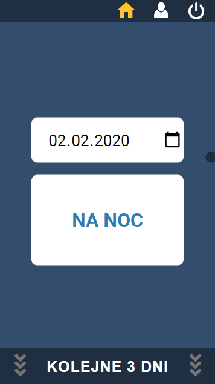
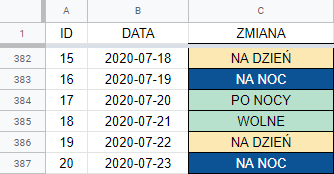
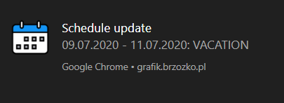
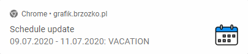
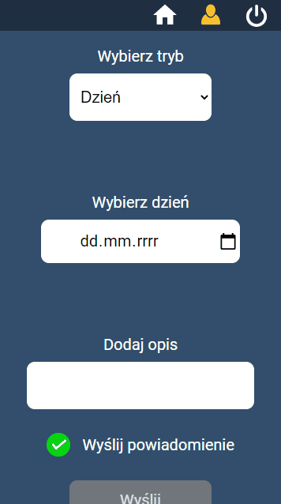

[Polish](README_pl.md) :point_left:

[](https://grafik.brzozko.pl/)

# Work schedule

> A progressive web application (PWA) with an administration panel, presenting the work schedule for the days selected by the user.

 </br>

<p align="center">
  
</p>

## Installation

The progressive web application (PWA) allows installations from a browser (Google Chrome recommended).
|Instruction |Attachment |
| ------------------------------------------------------ | :----------------------------------------: |
| 1. Visit https://grafik.brzozko.pl/ | |
| 2. In the address bar, press the "plus" symbol |  |
| 3. Select "Install"|

## Schedule

The presented work schedule consists of the following diagram:

| Nr  | Shift (Designation in the app)      | Comments                        |
| --- | ----------------------------------- | ------------------------------- |
| 1.  | Day shift (na dzień)                |
| 2.  | Night shift (na noc)                |
| 3.  | Day off after night shift (po nocy) |
| 4.  | Day off (wolne)                     |
| 5.  | Day shift (na dzień)                | :arrow_backward: schedule reset |
| 6.  | ⋮                                   |

By default, the application displays a work schedule based on the current date.

The user has the option to check the schedule up to one year in advance. Thanks to this, it is possible to plan holidays, holidays or other events in advance.

The history of the work schedule is also one year from the present date.

## Generating data

Generating new data is done using [Google Sheets](https://www.google.pl/intl/pl/sheets/about/). Then the data is sent to the [Firebase Realtime Database](https://firebase.google.com/docs/database/), which in turn is used by the application.
||
|:---:|
|_Part of the database in Google Sheets_|

</br>

## Data update

Updating the data contained in the Firebase real-time database, with data generated in Google Sheets, takes place using the [Firebase Realtime Database REST API](https://firebase.google.com/docs/database/rest/start).

### Preparation of data for sending (Google Apps Script)

```
function formatSprDataBeforeSending() {
  const ss = SpreadsheetApp.getActiveSheet();
  const formattedDataObject = {};

  for (
    let i = SPREADSHEET_CONSTANTS.DATA_ROW_START;
    i <= SPREADSHEET_CONSTANTS.DATA_ROW_END;
    i++
  ) {
    const date = ss
      .getRange(i, SPREADSHEET_CONSTANTS.DATE_COL)
      .getDisplayValue();
    const work = ss
      .getRange(i, SPREADSHEET_CONSTANTS.WORK_COL)
      .getDisplayValue();

    formattedDataObject[date] = work;
  }

  sendDataToFirebaseDB(formattedDataObject);
}
```

### Sending data to the Firebase Database (Google Apps Script)

```
function sendDataToFirebaseDB(payload) {
  const url = FIREBASE_UTILS.DB_URL + FIREBASE_UTILS.DB_SECRET_KEY;
  const options = {
    method: "put",
    contentType: "application/json",
    payload: JSON.stringify(payload),
  };

  try {
    UrlFetchApp.fetch(url, options);
  } catch (e) {
    Utilities.sleep(10000);
    sendDataToFirebaseDB(payload);
  }
}
```

## Notifications

The application allows, after obtaining the user's permission, to receive notifications informing about the fact of changing the schedule. [OneSignal](https://onesignal.com/) was used to send notifications.

</br>

| Browser               |                           Notification                           |
| --------------------- | :--------------------------------------------------------------: |
| Google Chrome Desktop |        |
| Google Chrome Mobile  |  |

</br>

## Administrator panel

The application offers an administration panel, thanks to which it is possible to make changes to the schedule (e.g. entering a vacation).

Editing changes offers the following editing modes:

</br>

| Mode       | Description                                                |
| ---------- | ---------------------------------------------------------- |
| Day        | Allows to edit a schedule for a specific date              |
| Days range | Allows to edit a schedule for a range of dates (from - to) |

</br>

Additionally, during each change, the user decides whether he wants to notify other subscribing users about the introduced edition.

</br>

<div align="center">
  
  <p><em>Administrator panel</em></p>
</div>

</br>

Logging in to the panel is done using [FirebaseUI](https://github.com/firebase/firebaseui-web).

[Firebase Realtime Database Rules](https://firebase.google.com/docs/database/security) are responsible for verifying user's permission to make changes.

## Meta

Łukasz Brzózko – lukasz@brzozko.pl

Distributed under the MIT license. See `LICENSE` for more information.

[https://github.com/lukasz-brzozko](https://github.com/lukasz-brzozko)
